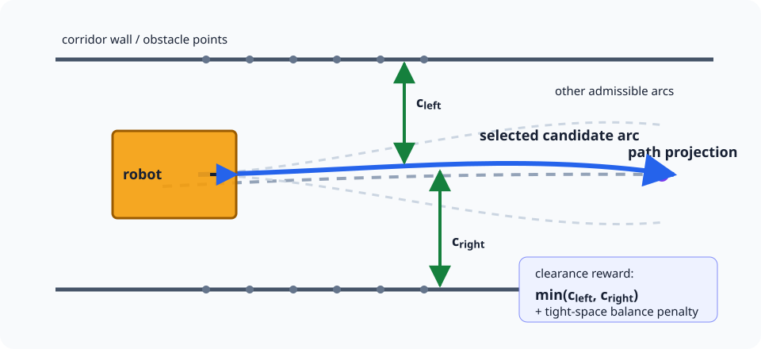
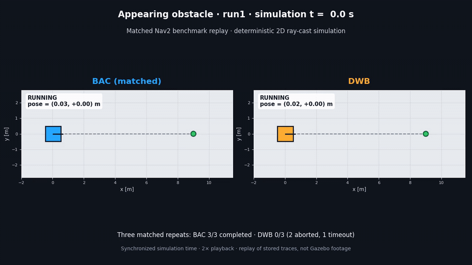
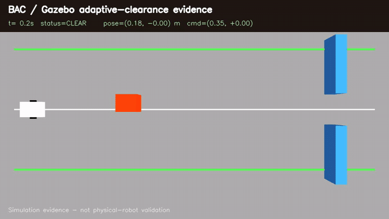

# bilateral_arc_clearance_controller

[English](README.md) | 日本語

Bilateral Arc Clearance（BAC、左右分離円弧クリアランス）は、候補円弧の左右に残る自由幅を直接評価する、
差動二輪・Ackermann・全方向車両向けのNav2ローカルcontrollerです。DWAの速度候補と停止可能性判定を基礎に、狭い開口では
実観測上の左右クリアランスを釣り合わせ、広い場所ではグローバル経路の追従を優先します。



提供する構成要素は次の3つです。

- `bac::BacCore`: ROSに依存しないC++17アルゴリズム
- `bac::BacController`: Nav2 `nav2_core::Controller`プラグイン（ROS 2 Jazzyで検証）
- `bac_filter_node`: 既存`cmd_vel`を生スキャンで整形する評価・レガシー統合用ノード

ライセンスはMIT、現在のパッケージバージョンは0.1.0です。

## 目的と主張の範囲

BACは、地図上の経路だけに障害物回避を委ねず、robot frameの局所観測を各制御周期で評価します。
これにより、単一pose estimateに基づくグローバル経路を有限周期で更新する構成と比べて、
**地図―odom間の横ずれと再計画遅延に対する感度を低減する**ことを目的とします。

これは上流から独立した安全保証ではありません。次の前提が必要です。

- 障害物観測の視野・鮮度・外部パラメータが用途を満たす
- planをbase frameへ変換するTFと、現在速度の推定が利用できる
- footprint、制御周期、制動能力が実機を保守的に表す
- 下位速度制御器が速度・加速度制限を実行できる
- 障害物を制御周期内では静的点群として扱える

生スキャンが有効な間、障害物幾何と左右クリアランスは地図―odom誤差に直接依存しません。一方、
経路追従項はTF変換後のplanに依存し、スキャン異常時のcostmap fallbackは再びcostmapとTFに依存します。
したがって本パッケージが主張するのは、上記前提と評価範囲内での**感度低減**であり、任意の上流異常に
対する不変性ではありません。設計上の性質と実測結果の区別は[アルゴリズムと保証範囲](docs/algorithm.md)
に整理しています。

## 評価結果

公開済みの公平条件benchmarkは現在のところ差動二輪モデルのみです。Ackermannのcoverageは後述する
決定論的な単体検査と閉ループ回帰試験に限られます。

ROS 2 Jazzyで、同一車体・NavFn・1 Hz再計画・world・10 Hz local costmap入力・controller候補は
前進のみ・共通0.4 m/s上限・共通actuator加速度制限を使い、公平条件評価として18シナリオ × 3 run × 4 controller = 216 episodeを
実行しました。controller固有の軌道生成、horizon、critic、tuningは必然的に異なります。
共通Nav2 recovery treeの`BackUp`は有効なため、system全体を前進のみにはしていません。

| controller | 成功 | 衝突 | 成功時平均 | 中央値 | 最接近の最悪値 |
|---|---:|---:|---:|---:|---:|
| BAC（matched） | 54/54 | 0 | 29.7 s | 28.4 s | 0.078 m |
| DWB | 48/54 | 2 | 24.6 s | 25.2 s | 0.000 m |
| MPPI（matched） | 51/54 | 0 | 27.9 s | 27.3 s | 0.049 m |
| RPP | 48/54 | 0 | 24.2 s | 24.8 s | 0.016 m |

BACはmatched評価の全episodeを完走し、他設定が完走しなかった出現障害物で3/3、1.5 m通路と
0.25 mの合成自己位置横ずれでも3/3成功しました。一方、Z字路では明確に遅くclearanceも小さく、
clutterの1反復では完走まで82.8 s停止しました。別のBACアブレーション216 episodeでは、左右均衡項を
外した極狭路offsetで、平均時間29.2→42.4 s、clearance 0.227→0.174 m、平均横偏差
0.028→0.053 mとなりました。全variantは54/54完走し、基準BACが後退を選ばなかったためescapeの
寄与は未同定です。

これは限定的な決定論的シミュレーション観測で、独立な成功確率、実機安全evidence、一般的優越の証明
ではありません。条件、限界、従来の機能有効system-level評価、既存controllerとの差は
[公平条件比較とアブレーション](docs/ablation_and_matched_evaluation.md)および
[手法比較](docs/method_comparison.md)を参照してください。

### 動画evidence



[高画質な25.5秒の左右比較MP4をダウンロード](docs/media/bac_vs_dwb_matched_appearing_obstacle.mp4)。上のGIFは
matched `appearing_obstacle/run1`をsimulation時刻で同期し2倍速再生した。BACは完走し、DWBは最終的に
中断した。画面下には3反復集計（BAC 3/3、DWB 0/3）も区別して表示する。これは保存済み2D ray-cast traceの
replayでGazebo映像ではなく、[入出力hash](docs/media/bac_vs_dwb_matched_appearing_obstacle_evidence.json)を
併記している。



[高画質な35.2秒のGazebo MP4をダウンロード](docs/media/bac_gazebo_adaptive_clearance.mp4)。上のGIFに示す
左から右への連続takeで、静的offset障害物から車体距離0.31 mを保ちつつ0.80 m迂回し、8.3秒で中心線から
0.30 m以内へ復帰した後、幅1.0 mのgateを中心偏差0.013 m以内で通過した。車体0.50 mと左右marginを
合わせた必要幅は0.74 mで、最終x=12.03 m、停止・車体接触0だった。局所障害物horizonは明記した2.5 mである。
[同期telemetry](docs/media/bac_gazebo_adaptive_clearance_telemetry.csv)、
[9判定と入力hash](docs/media/bac_gazebo_adaptive_clearance_evidence.json)、
[再現環境](examples/gazebo/README.md)を保存している。

左右replayは選択runと集計の可視化、Gazebo 1系列は定性的な統合evidenceであり、独立反復、実機evidence、
安全検証の代替ではない。

## Nav2での位置づけ

BACは、plan・局所障害物・現在速度から次の`(v,w)`を選び、経路からの局所逸脱も含めて進行を継続するため、
Nav2ではController Serverのプラグインが主な適用場所です。

```text
Planner → BAC / DWB / MPPI → Velocity Smoother → Collision Monitor → base
```

Collision Monitorは最終段で停止・減速する独立安全層であり、BACの代替ではありません。狭路だけBACを
使う場合は、複数controllerを登録し、BTのControllerSelectorなどで切り替えられます。costmap layer、
DWB critic、Collision Monitor、`bac_filter_node`との使い分けは[Nav2統合ガイド](docs/nav2_integration.md)
にまとめています。

## クイックスタート

ROS 2ワークスペースで依存関係を解決してビルドします。

```bash
cd /path/to/colcon_ws
rosdep install --from-paths src --ignore-src -r -y
colcon build --packages-select bilateral_arc_clearance_controller
colcon test --packages-select bilateral_arc_clearance_controller
colcon test-result --verbose
```

CIと同じクリーンなROS 2 Jazzy/Nav2環境でcontroller pluginとROS adapter testまで
検証する場合は、Docker環境を使用できます。

```bash
./docker/nav2-jazzy/verify.sh
```

詳細は[ROS 2 Jazzy / Nav2ビルド検証](docker/nav2-jazzy/README.md)を参照してください。
checkoutはread-onlyでmountされ、ビルド生成物は一時コンテナ内だけに残ります。

最小構成例です。車体寸法、制動能力、後方視野は実機に合わせて変更してください。
install対象の例は[差動二輪](config/bac_controller.yaml)と
[Ackermann操舵](config/bac_controller_ackermann.yaml)、[全方向](config/bac_controller_omni.yaml)に分けて用意しています。

```yaml
controller_server:
  ros__parameters:
    controller_frequency: 20.0
    controller_plugins: ["FollowPath"]
    FollowPath:
      plugin: "bac::BacController"
      motion_model.type: diff_drive
      scan_topic: /scan
      footprint.front: 0.5
      footprint.rear: -0.5
      footprint.width: 0.95
      limits.v_max: 0.4
      limits.v_min: 0.0  # 十分な後方観測がある場合だけ負値を使う
      stop_decel: 0.8
```

ROSなしでもcoreと閉ループシナリオを検証できます。

```bash
cmake -S . -B build -DCMAKE_BUILD_TYPE=Release
cmake --build build --parallel
ctest --test-dir build --output-on-failure
```

差動二輪の17本の閉ループシナリオはLiDARレイキャスト、加速度制限アクチュエータ、ユニサイクル運動学を
含みます。別のAckermann回帰試験13本と全方向回帰試験17本では、速度が加速度制限され曲率が有限速度でしか変化しないplantを使い、
操舵を即座に変えられない車両に対して指令を検証します。同梱の設定例そのものを走らせる試験を含むため、
利用者がコピーするファイルが試験の対象になります。

```bash
./build/bac_scenario_harness --strict --csv-dir traces
python3 test/plot_traces.py --dir traces
```

### 側方・後方ゴールの回帰テスト

ゴール方向のカバレッジとして、遠方側方、近傍側方、真後ろ、側方障害物によりその場旋回できない
真後ろの4ケースを検証します。

```bash
ctest --test-dir build -R BacGoalDirectionRegression --output-on-failure

./build/bac_scenario_harness --strict --csv-dir traces --filter goal_lateral_near
./build/bac_scenario_harness --strict --csv-dir traces --filter goal_behind
python3 test/plot_traces.py --dir traces goal_lateral_near goal_behind
```

現在の決定論的シミュレーションでは、後退を無効にした前方センサ構成でも0.5 m左のゴールへ8.250秒、
4.0 m真後ろのゴールへその場旋回後18.700秒、4.0 m左の正常対照へ13.050秒で到達します。
その場旋回の掃引範囲内に側方障害物があるケースでは、
後退下限`-0.1 m/s`を使って52 tick後退した後に姿勢を整え、21.150秒で後方ゴールへ到達します。
60秒の評価中に衝突と連続静止はありません。

候補は衝突可否だけでなく、順序付き経路上の符号付き進捗と経路接線の相対方位で評価します。近距離側方または
ほぼ真後ろではヒステリシス付き姿勢整合モードを優先し、その場旋回が安全でなければ後退へフォールバックします。
全4ケースのPASSと上記CTestの終了コード0が回帰条件です。

## 統合時の落とし穴

4台の深度カメラを積んだ差動二輪の屋外ロボットにBACを導入した際に、実際に時間を
取られた点。いずれもエラーメッセージは出ず、controllerの挙動がおかしいという形で
現れる。

### controllerに本物の現在速度を渡す

BACは、Nav2が `computeVelocityCommands` に渡す速度を中心とした加速度制限ウィンドウ
（`current.v ± acc_v * window_time`）から前進速度をサンプリングする。
`controller_server` はその速度を自身のodometry smootherから取り、その
`odom_topic` パラメータの**既定値は `odom`** である。そのトピックを誰も publish して
いないとsmootherは毎周期ゼロを報告し、BACは `acc_v * window_time` を超える候補を
出せない。`acc_v: 0.4` と既定の `window_time: 0.25` なら 0.1 m/s である。しかも
停止していると伝えられ続けるため、二度と上がらない。

症状は「計画も操舵も回避も正しいのに、`limits.v_max` の一定割合でしか走らない」。
ログには何も出ない。設定先は `controller_server` 自身であること。`bt_navigator` に
書いても別の購読者である。

```yaml
controller_server:
  ros__parameters:
    odom_topic: /odometry/filtered   # 実際に nav_msgs/Odometry を出しているトピック
```

存在するトピック名を指すだけでは足りない。`OdomSmoother` が読むのは `twist.twist`
だけで `pose` は一切見ない。位置だけ埋めて twist をゼロのままにしている publisher は
珍しくないが、その場合は購読が成立したまま、警告も出ないまま、まったく同じ症状に
なる。差動二輪なら `twist.twist.linear.x` と `twist.twist.angular.z` に実際の機体速度が
入っている必要がある（メッセージ規約どおり `child_frame_id` 系）。走行中に
`ros2 topic echo` で覗けばそれで確認できる。

通常の `ros2_control` 構成では、中身は問題にならない。`diff_drive_controller` も
`robot_localization` の `ekf_node` も twist を正しく埋めて publish する。問題になるのは
**名前**のほう。`diff_drive_controller` の publish 先は `~/odom`、つまりその名前の
controllerなら `/diff_drive_controller/odom` であり、Nav2 の既定は `odom` である。
`odom_topic` に実際の名前を設定するか、controllerの出力を `/odom` に remap するか、
どちらかを行うこと。どちらもしていない構成が、黙って失敗する構成である。車輪と
Nav2 の間にフィルタを挟む場合は、フィルタ後の推定値を Nav2 に渡す。計画に使う速度と
自己位置に使う `odom -> base_link` が同じ出所になるようにするため。

### `control_period` を実際の制御周期に合わせる

`control_period` は `acc_v` / `acc_w` を1周期あたりの変化量に変換する値であり、円弧の
ロールアウトもその間隔で指令が更新される前提に立つ。`controller_frequency: 20.0` と
宣言しながら実測6 Hzしか出ていない構成（深度カメラ数台がボクセルレイヤに流し込めば
容易に起こる）では、判断と判断の間に3倍の距離を進むことになり、公称周期で調整した
マージンは楽観的すぎる。Nav2は次のように報告する。

```text
Control loop missed its desired rate of 20.0000 Hz. Current loop rate is 6.4103
```

周期を改善するか、実際に出る周期に合わせて `limits.v_max` を下げること。

### `avoid_margin.side` は希望値、`safety_margin.side` が制約

歩行者への配慮で `avoid_margin.side` を広げても狭所が通れなくなるわけではない。
希望値は周囲が実際に許すクリアランスに適応するため、希望値より狭い通路も中央を
保って通過する。ただし巡航速度には効く。同じtightness指標が速度上限を
`tight_cruise_fraction`（下限は `creep_fraction`）に向けて抑制するため、
狭い環境で希望値を広く取ることは設計上そのまま「遅くする」ことを意味する。
硬い制約は `safety_margin.side` であり、コース最狭部と突き合わせるべきはこちら。

### 後退は脱出手段であって走行モードではない

後退候補には `limits.v_min < 0` が必要で、1加速ステップで到達できるとき（つまり
ほぼ停止時）にのみ提示され、さらに「経路を前進させる安全な前進候補が存在しない」
場合にのみ残る。本当に詰まったときに出るものと考えること。開けた場所で数メートル
後退する経路は、この機構が提供するものではない。

### 推測の前に診断を読む

`diagnostics_publish_period` を正にすると、BACは `obstacle_source`、`scan_state`、
`bac_status`、`candidate_count`、`admissible_count`、`best_clearance_m`、
`nearest_distance_m`、`best_path_cost_m` を `/diagnostics` に publish する。
外から見ると同じに見える状態を切り分けられる。

- `candidate_count` と `admissible_count` がともに0: BACには打つ手が一つもない。
  たいていロボットが既に自身のマージンの内側に入っている。
- `admissible_count` は十分あるのに指令がゼロのまま: スコアリングが停止か旋回を
  選んでいる。前進していた候補があるかは `best_path_cost_m` で分かる。
- `obstacle_source` は生スキャンとcostmapのどちらを見ているかを示す。
  controllerを疑う前に、何を見せていたのかを確認する価値がある。

### ロボット自身の構造を障害物入力から除く

デッキに載せたカメラは、全フレームの下端に自機のシャシーを写す。その点は距離ゼロの
障害物としてロボットと一緒に動き回り、クリアランス項は永久に前進を許さなくなる。
costmapやスキャンがBACに届く前に、画像の帯をクロップし、自機の体積を点群から
差し引くこと（`base_link` での負の `CropBox`）。そのボックスはシャシーに密着させる。
削った領域はcontrollerから見えないので、広すぎるボックスはバンパー直前の本物の
障害物を静かに消してしまう。

## 制約

- 2Dの差動二輪・Ackermann・全方向車両を、定曲率の車体運動として扱います。全方向モデルでは進行方向と
  機体方位が一定角だけずれた円弧になります。
- AckermannモードでもNav2への出力は車体前進速度とヨーレートであり、車両モデルは最小旋回半径1つです。
  これはnav2 MPPIの`AckermannConstraints`と同じ粒度です。下位の車両controllerで、たとえば
  `delta = atan(wheelbase * angular.z / linear.x)`により実舵角へ変換する必要があります。BACはwheelbase、
  実舵角、操舵速度をモデル化せず、操舵jointの実測feedbackも読みません。
- 前進のみの設定（`limits.v_min = 0`）で車体後方のgoalに到達できないのは**Ackermannだけ**です。BACは
  その場旋回を捏造せず停止し、切り返しはNav2側のrecoveryに委ねます。差動二輪はその場旋回で解決し
  （`test/scenarios.cpp` の `goal_behind` がまさにこの設定を走らせています）、全方向モデルは横移動で
  到達します。
- Nav2が渡すgoal姿勢に従えるのは全方向モデルだけです。ヨーで操舵する差動二輪とAckermannは方位を
  進行方向と独立に選べないため、goal姿勢を無視して経路接線に従います。
- 全方向モデルの横移動は車体側方のセンサ被覆を前提とします。前方のみのLiDARでは、斜行先が見えません。
- 動的障害物の速度・将来位置は推定しません。
- 出力ヨーレートを1制御周期後に到達可能な範囲へ制限しますが、角加速度・操舵過渡中の掃引軌道とjerkは
  未評価です。
- 後退は後方観測範囲が十分な場合だけ有効にしてください。
- 生スキャン異常時はcostmapへfallbackします。完全なfail-stopはCollision Monitor等の独立層で構成してください。
- 0.1.0はシミュレーション中心です。Ackermannの検証は決定論的な閉ループ試験であり、実車evidence
  ではありません。実機の遅延、滑り、外れ値、操舵追従、周期超過は別途評価が必要です。

## ドキュメント

- [ドキュメント索引](docs/README.md)
- [アルゴリズムと保証範囲](docs/algorithm.md)
- [Nav2統合ガイド](docs/nav2_integration.md)
- [パラメータリファレンス](docs/parameters.md)
- [既存手法との比較と評価](docs/method_comparison.md)
- [BACアブレーションと公平条件比較](docs/ablation_and_matched_evaluation.md)
- [ROS 2 Jazzy / Nav2ビルド検証](docker/nav2-jazzy/README.md)
- [再現可能なGazebo evidence](examples/gazebo/README.md)
- [リリースレビュー履歴](docs/release_review_history.md)
- [Public 公開準備チェックリスト](docs/public_release_checklist.md)
- [English documentation / 英語ドキュメント](docs/en/README.md)

## ライセンス

[MIT License](LICENSE)
