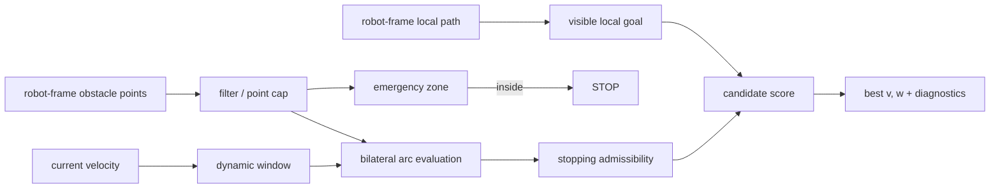

# bilateral_arc_clearance_controller

Bilateral Arc Clearance (BAC、左右分離円弧クリアランス) は、狭い開口で左右の実クリアランスを
直接釣り合わせる差動二輪向けローカル controller です。Dynamic Window Approach (DWA) の
速度候補と停止可能性判定を使いながら、障害物評価を候補円弧の左右自由幅へ置き換えています。


主な構成は次の3つです。

- `bac::BacCore`: ROS に依存しない C++17 コアライブラリ
- `bac::BacController`: Nav2 `nav2_core::Controller` プラグイン（ROS 2 Jazzy で検証）
- `bac_filter_node`: `LaserScan` で上位 `cmd_vel` を整形する評価用ノード

ライセンスは MIT、現在のパッケージバージョンは 0.1.0 です。

## 目的 — 実行層の頑健性契約

BAC は最速の controller を目指していません。提供するのは、上流(自己位置推定・地図・グローバル
プランナ・再計画レート)の状態に依らず実行層で成立する、**測定可能な頑健性契約**です。
同一条件・単一リビジョンのベンチマーク(18 シナリオ × 各 3 run、controller あたり 54 episode)での実測:

- 障害物 0.15 m 以内への接近ゼロ、衝突ゼロ(標準 3 controller は成功 episode でも数 cm の掠りが発生)
- 速度は障害物への近接に単調応答: 余裕があれば巡航、狭ければ減速、安全マージン床を下回る幅には進入しない
- 行き詰まりでは凍結せず、安全に後退して待つ
- 自己位置ズレ 0.10〜0.25 m の 1.5 m 通路で**到達時間もクリアランスも不変**(全域 28.8 s / 0.22〜0.23)。
  同じ 0.25 m で DWB・RPP は中断・衝突・数 cm 擦過のいずれかに陥り、プランナ側のマージン対策でも
  「依然衝突」か「計画不能」にしかならない

単一ポーズ推定のグローバル経路を有限周期で更新する標準的な構成では、この頑健性をプランナ側
だけで代替できません。ロボット座標系の障害物幾何・緊急停止判定・左右クリアランスは地図↔
オドメトリ誤差に直接依存しません(経路追従項は誤差の影響を受けますが、弱い横偏差重みと
左右クリアランスの作用により、本評価範囲では挙動劣化が観測されませんでした)。加えて再計画の
合間の窓はプランナには埋められず、近接減速はそもそもプランナの語彙にありません。検証は
[既存手法との比較](docs/method_comparison.md) の「実行層の頑健性契約」節を参照してください。

グローバルプランは「意図の方向」としてだけ使い、実際に通る場所は生センサの幾何から決める——
経路が通路中心からずれても、再計画前の経路上に障害物が残っても、挙動が破綻しないのはこの
設計の帰結です。

## 何を解決するか

一般的な経路追従 controller は、経路が通路中心からずれた場合や、未知障害物が再計画前の経路上に
残った場合に、経路項と障害物項の重みが競合します。BAC は広い場所ではクリアランス報酬を飽和させて
経路を素直に追い、両側が狭い場所だけ左右差ペナルティを強めます。これにより、設定した回避余裕を
両側で同時に満たせない通路でも、停止せず実際の開口中心へ収束させます。



## アルゴリズム

1. 入力点群を距離・自己反射除外箱でフィルタし、`max_points` を超えたら等間隔に間引く。
2. 現在速度の制動距離を含む車体矩形を異方性の角丸余裕で拡張し、内部に点があれば停止する
   （移動中は制動を優先。停止済みなら後退エスケープ候補のみ許可し、凍結しない）。
3. 衝突コース上の点だけに働く速度ガバナで並進上限を決める。直進予測でぶつかる点へは
   先読み距離の線形ランプ、狭い隙間をすれ違う予定の点へは自身の速度依存マージンが隙間を
   飲み込まない速度まで。平行な壁では減速しないため、直線狭路は巡航速度で通過する。
   旋回中は現在の (v,w) 円弧が余裕を持って外す点を判定から解除する（解除専用なので
   直進時の挙動は不変。コーナーで機首が掃く壁を「正面の脅威」と誤読して徐行し続ける
   ことを防ぐ）。
4. 並進加速度窓内の `v` と `[-w_max, w_max]` の `w` を組み合わせる。停止、回頭後直進、
   前進不能時の短い後退も候補に含める。最良候補の周囲は角速度を細分して再評価する。
5. 候補円弧上の最初の車体衝突点までに停止できない候補を棄却する。
6. 候補終端を経路へ射影し、進行弧長（進行度）・経路接線との方位誤差・弱い横偏差で経路追従を
   採点する。進行度と接線は経路の横ずれに一次不感なので、自己位置推定誤差で経路がずれても
   採点が乱れない。障害物で塞がれた経路区間は横引力を持たない（回避の膨らみと競合しない）。
   これに左右クリアランス、狭所の左右差、前回操舵との差、側方圧迫を加える。回頭・停止候補は
   「回頭後に直進した到達点」で採点し、ゴールから逸れた向きで立ち尽くす均衡を排除する。
   最良候補と診断量を返す。

既定値での概略スコアは次です。`tightness` は両側が狭いときだけ 1 に近づきます。

```text
score = 2.0 * min(clearance, adaptive_cap)
      - 4.0 * tightness * abs(clearance_left - clearance_right)
      - 1.0 * (remaining_path_arclength + 0.3 * path_offset)
      - 0.15 * abs(heading_error_vs_path_tangent)
      - 0.6 * abs(w - previous_w)
      - 0.5 * abs(v) * lateral_squeeze
```

低速時の近視眼化を避けるため最低 1.6 m を評価しますが、曲線を遠くまで外挿して反対側の壁を
誤って罰しないよう、評価角と横変位に上限を設けています。詳細な意図と既定値は
[パラメータリファレンス](docs/parameters.md)を参照してください。

## ビルドとテスト

ROS 2 ワークスペースでは Nav2 を含む依存パッケージを解決してから実行します。

```bash
cd /path/to/colcon_ws
rosdep install --from-paths src --ignore-src -r -y
colcon build --packages-select bilateral_arc_clearance_controller
colcon test --packages-select bilateral_arc_clearance_controller
colcon test-result --verbose
```

ROS を使わずコアとテストだけをビルドできます。

```bash
cmake -S . -B build -DCMAKE_BUILD_TYPE=Release
cmake --build build --parallel
ctest --test-dir build --output-on-failure
```

テストは小さな幾何・状態遷移チェックと、LiDAR レイキャスト、加速度制限アクチュエータ、
ユニサイクル運動学を含む13本の閉ループシナリオです。シナリオハーネスを直接使うと CSV を残せます。

```bash
./build/bac_scenario_harness --strict --csv-dir traces
python3 test/plot_traces.py --dir traces
```

対象は開空間、緊急境界、単一障害物、幅 2.5/1.7/1.5 m の通路、オフセット・壁付き入口、L字路、
Z字路（逆向き 2 連コーナー）、0.15 m ずれた経路、経路上障害物、密集障害物です。`--filter NAME` と
`--w-clearance/--w-path-dist/--w-balance/--w-hysteresis` で回帰確認と重み sweep ができます。

## Nav2 プラグイン

```yaml
controller_server:
  ros__parameters:
    controller_frequency: 20.0
    controller_plugins: ["FollowPath"]
    FollowPath:
      plugin: "bac::BacController"
      scan_topic: /scan       # 推奨。空なら costmap の LETHAL セルを使用
      scan_timeout: 0.5
      scan_downsample: 1
      footprint.front: 0.5
      footprint.rear: -0.5
      footprint.width: 0.95
      safety_margin.front: 0.2
      safety_margin.rear: 0.2
      safety_margin.side: 0.2
      avoid_margin.side: 0.6
      limits.v_max: 0.4
      limits.v_min: -0.1      # 後方センサがなければ 0.0
      limits.w_max: 1.0
      limits.acc_v: 0.8
      weights.balance: 4.0
      sim_time: 2.5
```

プラグインは plan を TF で base frame へ変換します(plan の frame_id 欠落や TF 失敗は
controller error)。生スキャンも TF で base frame へ変換し、未受信・古い・有効点が
`scan_min_points` 未満・TF 失敗のときは costmap の lethal セルへフォールバックします。
完全な fail-stop が必要な場合は上位 safety supervisor でセンサ鮮度を監視してください。

コストマップ入力ではセル中心の量子化誤差を `costmap_margin_compensation` で安全余裕から控除します。
生スキャン使用時の既定値は 0、コストマップのみなら解像度の半分です。

## `cmd_vel` フィルタノード

```bash
ros2 run bilateral_arc_clearance_controller bac_filter_node \
  --ros-args -r scan:=/scan -r odom:=/odom \
             -r cmd_vel_in:=/nav_cmd_vel -r cmd_vel_out:=/cmd_vel
```

上位 `(v,w)` を長さ `virtual_path_length` の仮想円弧へ変換します。障害物が
`influence_range` 外なら入力を透過し、`AVOIDING` ではコア出力を使い、スキャン途絶時は停止します。
`avoid_status` (`std_msgs/Int8`) は `0=CLEAR`, `1=AVOIDING`, `2=STOP` です。

フィルタノードは TF を使わないため、LaserScan が base frame でなければ `sensor.x/y/yaw` を必ず
設定してください。純回頭指令は仮想経路への近似であり、最終用途では Nav2 プラグインを推奨します。

## 既存手法との比較

DWA/DWB、MPPI、RPP、VFH、Nearness Diagram との設計比較、一次資料、ROS 2 Jazzy 上の
18シナリオ比較結果と限界を [既存手法との比較](docs/method_comparison.md) に整理しました。

要点は、BAC が通常条件で最速の controller ではないことです。単一リビジョン・同一条件の
ベンチマーク（18 シナリオ × 3 run）では BAC は全 54 episode を完走し、成功時平均到達時間は
27.8 秒でした（DWB 24.6 秒 (50/54 成功・衝突 2)、MPPI 29.2 秒 (51/54)、RPP 24.2 秒 (48/54)。
controller ごとに成功集合が違うため時間は参考値）。BAC の利点が出たのは、自己位置がずれた
狭路と、経路上へ後から障害物を出した条件で、これらは追従型 controller が失敗または衝突しました。
数字を一般的な成功確率とは解釈しないでください。

## 制約とリリース前確認

- 点群は瞬間的な静的障害物として扱い、障害物速度や将来位置を予測しない。
- 差動二輪の定曲率円弧を前提とし、holonomic / Ackermann の motion model は持たない。
- 角速度候補は全範囲から選ぶ。core は出力角速度を実測値から 1 制御周期で到達可能な範囲へ
  制限し（`limits.acc_w`）、クランプ後円弧の停止可能性を再検証するが、角加速度**過渡中**の
  掃引軌道と jerk は未評価。実機の角加速度・jerk 制限の実行は下位速度制御器の責務。
- `limits.v_min < 0` は後方の観測範囲が十分な場合だけ使う。
- `scan_topic` を使っても、古いスキャン時は costmap へフォールバックする。完全な fail-stop が必要なら
  上位 safety supervisor でセンサ鮮度を監視する。
- 0.1.0 の評価はシミュレーション中心であり、実機の遅延、滑り、外れ値、周期超過は別途検証が必要。

公開前には対象ロボット寸法、制動能力、後方視野、下位角加速度制限を確認し、実機設定で
`bac_scenario_harness --strict` と Nav2 ベンチマークを再実行してください。
