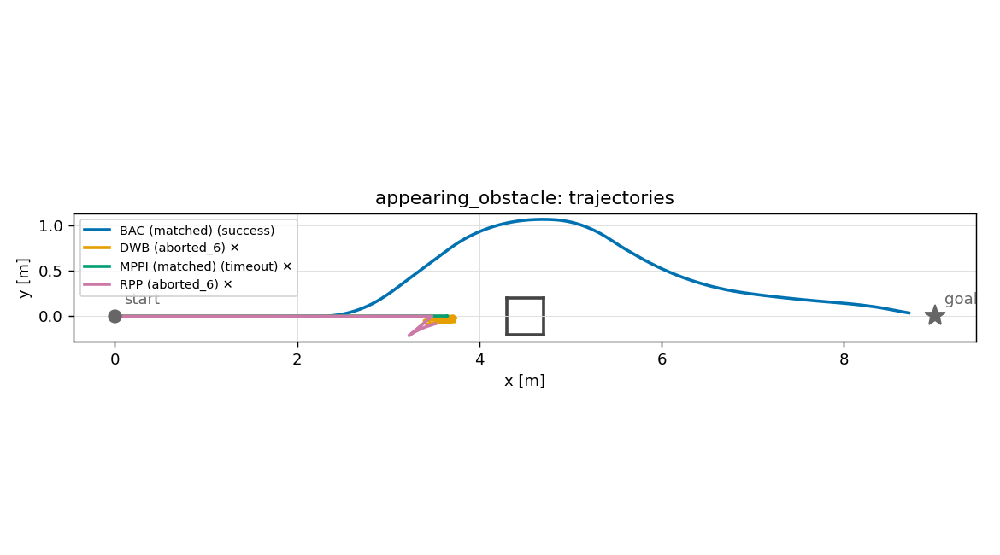
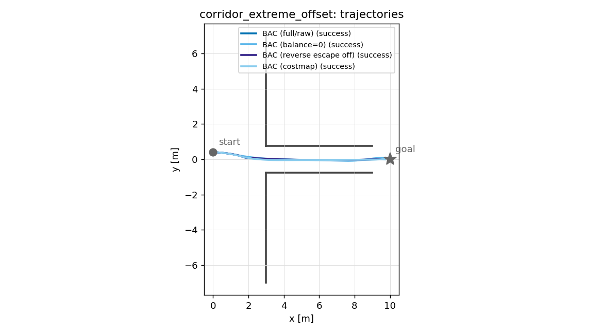
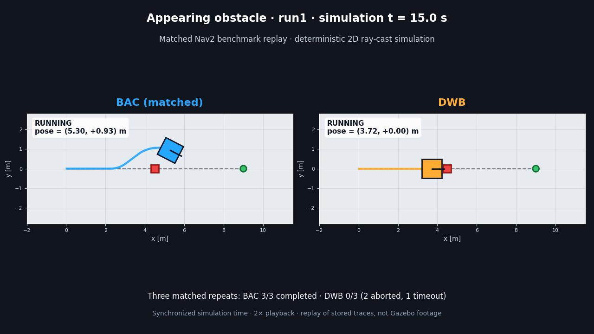
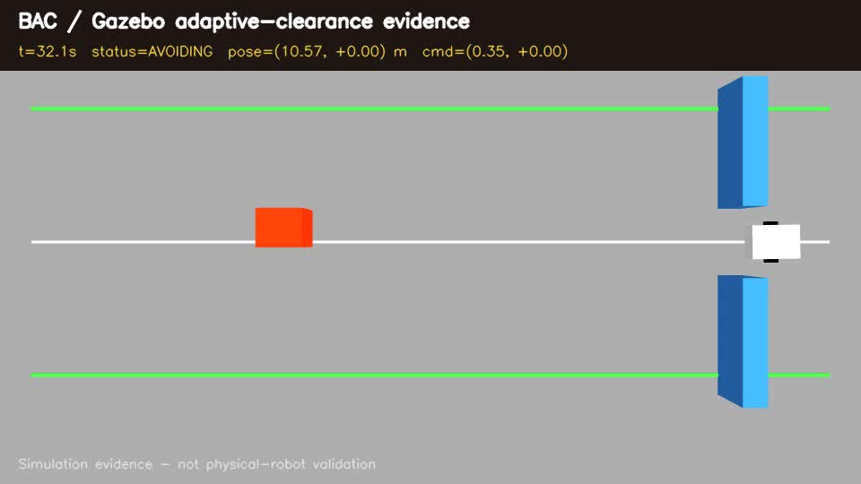

# BACアブレーションと公平条件比較

[English](en/ablation_and_matched_evaluation.md) | 日本語

- 評価日: 2026-08-29
- BAC: `25f12be18ab8256e0862134e0dee955966b60e2c`（dirty 0）
- benchmark: `4fed3d27e601d595d16552920797b76d8d57882c`（dirty 0）
- 環境: ROS 2 Jazzy / Nav2 1.3.12 / 2D LiDAR raycast simulator
- container image: `sha256:d58fe8c8f5790cd000cf7bdc1b46395ac2567c231cd592ae6d29426ba9eb2737`

本評価は、従来の機能有効状態でのsystem-level比較に残っていた入力源、後退可否、運動制限の差を
減らした比較と、BAC内部の3要因を分解する評価である。公平条件比較216 episodeとアブレーション
216 episodeは別の結果rootに保存し、合計432 episodeを混在させていない。

## 公平条件比較

### 揃えた条件

| 条件 | BAC | DWB | MPPI | RPP |
|---|---|---|---|---|
| 障害物入力 | 10 Hz local costmap | 同左 | 同左 | 同左 |
| 前進速度 | 0〜0.4 m/s | 同左 | 同左 | 同左 |
| controllerの後退候補 | 無効 | 無効 | 無効 | 無効 |
| simulatorの並進加減速度 | ±0.8 m/s² | 同左 | 同左 | 同左 |
| simulatorの最大角加速度 | 2.5 rad/s² | 同左 | 同左 | 同左 |
| controller周期 | 20 Hz | 同左 | 同左 | 同左 |
| local costmap更新 | 10 Hz | 同左 | 同左 | 同左 |
| footprint | 1.0 × 0.95 m矩形 | 同左 | 同左 | 同左 |
| planner | NavFn、1 Hz再計画 | 同左 | 同左 | 同左 |

BACは`scan_topic: ""`と`limits.v_min: 0.0`、MPPIは`vx_min: 0.0`を用いた。他の比較設定は
従来の正準設定を保った。共通Nav2 behavior treeの`BackUp`は無効化していない。失敗後のrecoveryで、
DWBの4 episodeとRPPの6 episodeが最大`-0.15 m/s`を出したため、**controller候補は前進のみだが、
Nav2 system全体は前進のみではない**。

### 揃えられない条件

公平化は、各controllerを同じアルゴリズムへ変えることではない。候補生成、critic、lookahead、
trajectory horizonは固有である。代表的にはBAC 2.5 s、DWB 1.7 s、MPPI 2.8 s
（56 × 0.05 s）、RPPの衝突時間上限1.0 sであり、scoreとtuningも異なる。角速度設定もBAC/DWB/
MPPIの上限1.0 rad/sに対してRPPのrotate-to-heading目標は0.6 rad/sで、完全には一致しない
（実測`|cmd_w|`は全方式1.0 rad/s以下）。したがって結果は
共通の入出力・運動制約下での設定済みcontroller比較であり、bilateral clearanceだけの因果効果ではない。

### 全体結果

18 scenarios × 3 runs × 4 controllers = 216 episodeを実行した。成功時時間の平均・中央値は失敗に
罰点を与えず、最小clearanceは失敗episodeも含む有限値から算出した。

| controller | 成功 | 失敗内訳 | 衝突 | 成功時平均 | 成功時中央値 | 最悪clearance | clearance中央値 |
|---|---:|---|---:|---:|---:|---:|---:|
| BAC（matched） | 54/54 | なし | 0 | 29.7 s | 28.4 s | 0.078 m | 0.253 m |
| DWB | 48/54 | 衝突2、中断2、timeout 2 | 2 | 24.6 s | 25.2 s | 0.000 m | 0.208 m |
| MPPI（matched） | 51/54 | timeout 3 | 0 | 27.9 s | 27.3 s | 0.049 m | 0.285 m |
| RPP | 48/54 | 中断6 | 0 | 24.2 s | 24.8 s | 0.016 m | 0.288 m |

3回のrunは乱数を使わないsimulatorの再現性確認であり、独立な統計標本や一般的成功確率として扱わない。

### 差が現れた条件

| scenario | BAC | DWB | MPPI | RPP | 限定的な読み方 |
|---|---|---|---|---|---|
| `appearing_obstacle` | 3/3成功、25.5 s、clr 0.302 m | 0/3 | 0/3 | 0/3 | 急な占有変化に対する本設定の差。任意の動的障害物へ一般化しない |
| `corridor_locdrift_15x` | 3/3、28.8 s、clr 0.213 m | 1/3、2衝突 | 3/3、34.7 s、clr 0.069 m | 0/3 | 1.5 m通路と0.25 m横ずれの合成条件に限る |
| `corridor_extreme_offset` | 3/3 | 2/3、timeout 1 | 3/3 | 3/3 | DWBの失敗は1反復だけで、恒常差とはしない |
| `corridor_zigzag` | 3/3、29.5 s、clr 0.154 m | 3/3、21.3 s、0.256 m | 3/3、27.1 s、0.286 m | 3/3、20.8 s、0.261 m | BACは遅く、clearanceも小さい |
| `corridor_zigzag_locdrift` | 3/3、38.8 s、clr 0.123 m | 3/3、21.2 s、0.203 m | 3/3、27.3 s、0.211 m | 3/3、20.8 s、0.204 m | 位置ずれZ字路はBACの明確な弱点 |

出現障害物の軌跡overlay。決定論的な3反復はほぼ重なる。凡例は代表outcomeを示し、全反復の成否は
上表とraw `summary.csv`を正とする。

BACは`clutter_field`も3/3成功したが、1反復で118.1 s、停止82.8 s、最小clearance 0.078 mとなった。
他2反復は29.7〜30.0 sだったため、平均時間が悪化した。成功率だけではこの停滞を隠すので、公開時は
軌跡と連続量を併記する。

この結果は、試験した出現障害物と大きな横ずれに対してBACが安定して完走したことを示す。一方、通常の
経路追従とZ字路ではRPP/DWBが速く、MPPIは多くの条件で大きなclearanceを保った。BACを一般に最速・
最安全・他controllerの代替とする根拠ではない。

## BACアブレーション

通常BACを基準に、1要因ずつ変更した。

| variant | 基準からの変更 | 意図 |
|---|---|---|
| `bac` | なし。20 Hz raw scan、`v_min=-0.1` | 機能有効の基準 |
| `bac_no_balance` | `weights.balance=0` | 左右均衡項の寄与 |
| `bac_no_escape` | `limits.v_min=0` | 後退候補を除く |
| `bac_costmap` | `scan_topic=""` | 10 Hz local costmap入力へ変更。後退は維持 |

全variantが54/54成功、衝突0だった。従って、この試験集合ではいずれの要因も成功可否に必須とは
示されなかった。差は連続量と軌跡に現れた。

### 左右均衡項

| scenario | BAC 時間 / clr / mean\|lat\| | balanceなし 時間 / clr / mean\|lat\| |
|---|---:|---:|
| `corridor_narrow_walled` | 28.5 s / 0.328 / 0.033 m | 29.2 s / 0.301 / 0.054 m |
| `corridor_narrow_walled_aligned` | 28.4 / 0.323 / 0.041 | 28.8 / 0.239 / 0.100 |
| `corridor_extreme_aligned` | 28.8 / 0.230 / 0.028 | 30.4 / 0.205 / 0.035 |
| `corridor_extreme_offset` | 29.2 / 0.227 / 0.028 | 42.4 / 0.174 / 0.053 |
| `corridor_locdrift_17` | 28.4 / 0.323 / 0.022 | 28.8 / 0.222 / 0.124 |

全variantが完走する一方、balanceなしの軌跡は中心線からの偏りと到達時間に差が現れる。図は成否だけで
なく、連続量を併記する必要性を示す補助資料である。

各値は3 runの算術平均である。これらの条件では3反復とも同方向に変化し、左右均衡項が狭路中心化、
clearance、または到達時間へ寄与するという設計意図と整合した。ただし、候補scoreから1項を外した
実装固有の結果であり、学術的新規性や他方式への優越を単独で証明しない。

### 後退候補

`bac_no_escape`も54/54成功した。位置ずれZ字路の平均は30.2 sから60.7 sへ増えたが、長時間停止は
1反復（118.9 s、停止87.3 s）に集中した。さらに、基準BACは全54 episodeで負の`cmd_v`を一度も
選んでいない。このため、この差を「escapeが回復させた」と因果解釈できない。後退が実際に必要な
scenarioを別途設計するまで、escapeの寄与は未同定とする。

### raw scanとcostmap

`bac_costmap`も54/54成功し、raw scanは本試験集合の完走に必須ではなかった。多くの静的狭路では差が
小さいかcostmap版が同等だった。一方、位置ずれZ字路では、raw版30.2 s / clr 0.155 mに対して
costmap版37.2 s / 0.118 mとなり、2反復で後退指令を選んだ。出現障害物では両方3/3成功したが、
平均clearanceはraw 0.304 m、costmap 0.264 mだった。raw入力が常に優れるという結果ではなく、
更新周期、costmap量子化・inflation、候補選択の相互作用を含む入力経路差である。

## 完全性と再現性

両データセットについて次を確認した。

- 期待216 / 観測216 / 欠損0 / 破損0 / 期待外0
- 90 domainを使用、再割当126回、domain保持区間の重複0
- provenance v2の`bench_tree_sha`、Git tree object、`worlds_sha`を3/3再現
- BAC/benchmark worktree dirty 0、設定、world、container digestを記録

結果rootは`results_matched_release_25f12be/`と`results_ablation_release_25f12be/`である。

## 動画evidence

### BAC対DWBの左右比較

matched datasetの`appearing_obstacle/run1`を左右で同期し、2倍速で再生した25.5 sの動画である。同じ
world、出現時刻、初期状態で、BACは25.6 sで完走し、DWBは最終的に`aborted_6`となった。画面下の
「BAC 3/3、DWB 0/3（abort 2、timeout 1）」はrun 1だけでなく同条件3反復の集計である。
[evidence JSON](media/bac_vs_dwb_matched_appearing_obstacle_evidence.json)にworld、両trace、episode、renderer、
出力のSHA-256を保存した。これは保存済み2D ray-cast traceのreplayであり、Gazeboや実機の映像ではない。

### Gazebo adaptive-clearance 1系列

数値ベンチマークとは独立したBAC 1系列をGazebo Classic 11.10.2 / ROS 2 Humbleで収録した。20 Hz
ray sensor、odometry、body contact sensor、差動駆動を接続し、上流は最大0.35 m/sで中心線を追従する。
静的offset障害物の回避・中心線復帰・幅1.0 mのgate通過を左から右への連続takeにした。局所障害物の
入力horizonは2.5 mで、有限local costmap相当のデモ条件であり、default推奨値ではない。
0.50 mのbodyと左右0.12 mの設定marginを合わせた必要幅は0.74 mである。Humble環境ではJazzy Nav2
adapterを除外し、同じ`bac_core`を使う`bac_filter_node`を接続した。

| 判定量 | 結果 |
|---|---:|
| 動画 | 34.9 s、960 × 540、12 fps、419 frame |
| 障害物と物理車体の最小距離 | 0.309 m（設定side safety marginの2.6倍） |
| 最大横偏差 | 0.798 m |
| 最大偏差から`abs(y) <= 0.30 m`まで | 8.3 s |
| 最大偏差から`abs(y) <= 0.10 m`まで | 13.1 s |
| gate直前の最大`abs(y)` | 0.042 m |
| gate内の最大`abs(y)` | 0.014 m |
| 最終進行距離 x | 11.91 m |
| `STOP` | 0 frame |
| body contact | 0 |

動画内に時刻、状態、pose、出力commandと「実機検証ではない」旨を重畳した。全frameと同期した
[telemetry CSV](media/bac_gazebo_adaptive_clearance_telemetry.csv)、9判定の
[evidence JSON](media/bac_gazebo_adaptive_clearance_evidence.json)、Docker/world/URDF/収録・評価scriptを含む
[再現手順](../examples/gazebo/README.md)を保存する。JSONは収録時commitと主要入力のSHA-256を記録する。

これはGazebo上でsensor-to-actuator接続が動き、当該1条件で広い場所の余裕と狭所通過を両立したという
定性的な統合evidenceである。左右比較とはsimulatorもデータも別であり、独立な成功確率、実機の遅延・
滑り・外れ値、安全性を示すものではない。
