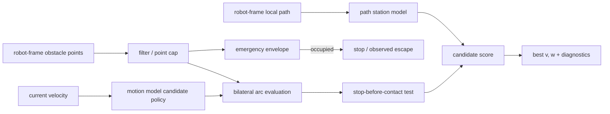

# アルゴリズムと保証範囲

[English](en/algorithm.md) | 日本語

## 対象

BACは、矩形footprintを持つ差動二輪・Ackermann・全方向ロボットについて、robot frameの障害物点、robot
frameへ変換した局所path、現在の並進・角速度から、次の定曲率指令`(v,w)`を選ぶ。障害物は1制御周期内
では静的点群とする。どちらのモデルも車体は定曲率で運動するものとして扱う。差動二輪は並進候補だけを
scoring上の下限`turn_radius_min`で縛り、その場旋回は自由である。Ackermannは車体曲率そのものを
運動学制約として縛り、その場旋回を持たない。nav2 MPPIと同じく、車両モデルの記述はこの車体レベルの
制約までとし、road-wheel kinematicsは下位controllerの責務とする。




## 処理

1. 入力点を距離と自己反射除外boxでfilterし、`max_points`を超える場合は入力順を保って間引く。
2. 現在速度の制動距離を含むfootprint周囲のemergency envelopeを調べる。移動中に点が入れば停止を
   優先し、停止済みならoffending pointから離れる低速escape候補だけを許す。後退escapeを有効にする
   場合は、後方観測を前提にできなければならない。
3. 現在の進行方向で衝突コースにある点から並進速度上限を計算する。平行壁のように現在円弧が余裕を
   持って外す点は、この減速判定から除外する。
4. 選択したmotion modelで候補を生成する。差動二輪は並進dynamic windowとヨーレートを組み合わせ、
   その場旋回も追加できる。Ackermannは後退を含む各速度について許容曲率
   `|kappa| <= min(1 / turn_radius_min, w_max / |v|)`をsampleし`w = v * kappa`へ変換する。
   その場旋回は候補格子に現れない。後退有効時はどちらも停止近傍の
   escape候補を追加できる。
5. 各候補について、定曲率運動中の矩形footprintと障害点の初接触弧長を閉形式で求める。接触前に
   設定した`stop_decel`で停止できない候補は棄却する。
6. 候補終端をpathへ射影し、進行度、経路接線との方位差、弱い横偏差を計算する。障害物で塞がれた
   path区間では横偏差の引力を無効化する。
7. 左右クリアランス、狭所での左右差、path項、前回操舵との差、側方圧迫を合成する。粗探索後は差動二輪
   ならヨーレート、Ackermannなら曲率の近傍を細分し、1周期到達可能範囲へ制限して円弧を再検証する。
   接触により追加減速する場合は`v`と`w`を同率で下げて曲率を保存し、必要なら到達可能性と接触を再検証する。

既定値での概略scoreは次のとおりである。`tightness`は両側が狭い場合だけ1へ近づく。

```text
score = 2.0 * min(clearance, adaptive_cap)
      - 4.0 * tightness * abs(clearance_left - clearance_right)
      - 1.0 * (remaining_path_arclength + 0.3 * path_offset)
      - 0.15 * abs(heading_error_vs_path_tangent)
      - 0.6 * steering_change
      - 0.5 * abs(v) * lateral_squeeze
```

低速時も最低`min_eval_distance`まで評価する。ただし遠方まで円弧を外挿して反対側の壁を誤評価しない
よう、評価角`eval_angle_max`と横変位`eval_lateral_max`で窓を制限する。`steering_change`は差動二輪では
ヨーレート差、Ackermannでは車体曲率差である。全パラメータと単位は[パラメータリファレンス](parameters.md)
を参照する。

## 主張を3段階に分ける

### 実装で固定している判定規則

- 観測点がemergency envelope内にある間、通常の前進候補を出さない。
- 観測した静的点との予測接触前に停止できない定曲率候補を採用しない。
- 衝突コース上の点に対する並進速度上限は、同じ判定条件内では近づくほど厳しくなる。
- 狭所では左右クリアランス差をscoreへ明示的に入れる。

これらは入力点、footprint、制動modelが正しいという条件下の**アルゴリズム上の規則**である。
センサ未観測領域や実機追従誤差を含む衝突回避保証ではない。

### シミュレーションで観測した性質

以下の公開済みbenchmark観測は差動二輪モデルによる。

- 正準18シナリオ × 3 runでBACは54/54成功、衝突0、最接近0.136 mだった。
- 1.5 m通路のpath横ずれ0.10〜0.25 mでは8/8成功し、平均到達時間28.8 s、クリアランスは
  0.225〜0.230 mだった。
- 1 runの開口幅sweepでは1.25 mまで完走したが、1.15 mでは最接近0.050 m、timeoutとなった。
  他の3 controllerは同じ1.15 m試行を完走しており、この境界条件でBACの優位性は観測されなかった。
- 全方向policyは、回避を横速度で行いヨーレートを姿勢規範に使う。候補格子は「前進速度 × 横速度」で、
  次元は差動二輪の「前進速度 × ヨーレート」と同じ2次元である（実測の候補数はomni 96・差動二輪130で、
  同数ではない）。ヨーレートは候補生成の前に確定するため、
  採点し接触判定する軌道と実際に走る軌道が一致する。狭所では左右クリアランスの不均衡を姿勢規範へ加え、
  斜行ではなく機体を隙間へ向ける（斜行する矩形は直進より広く掃引するため。0.7 × 0.5 mの車体が55°で
  0.86 m、直進なら0.5 m）。この項は通路条件（両側がcap以内かつ正面が開いている）でのみ働く。
  **測定条件を明記する**（R15 M12は、条件を書かない数値表がレビューアの手元で再現しないことを指摘した）。
  進入オフセット0.30 m、両モデルとも`avoid_margin.side = 0.9`、通路長7 m、`heading_gain = 1.5`。
  この条件（壁厚0.10 m）での平均横偏差は、通路幅1.1 / 1.2 / 1.3 / 1.6 / 1.8 mに対し
  0.0131 / 0.0148 / 0.0171 / 0.0159 / 0.0160 mであり、同条件の差動二輪（0.0259 / 0.0280 / 0.0288 /
  0.0260 / 0.0255 m）に対して1.6〜2.0倍小さい。`avoid_margin.side`を下げると左右均衡項が発火せず、
  1.6 m通路での平均横偏差は0.9で0.0119 m、0.5で0.139 mになる。発火境界は0.68と0.70の間にあり遷移は非単調で、
  0.8でも0.9とほぼ同じ値に達する。
  **進入オフセットには限界がある**。0.30〜0.50 mを0.002 m刻みで掃引した実測（101セル、接触・非完走・
  通路外への迂回のいずれかを不合格とする）では、厚み0.10 mの壁で幅1.2 mの通路は**全101セルが合格**、
  幅1.1 mでは0.418 mから不合格になる。厚みゼロの線分でモデル化するとどちらも悪化し、幅1.2 mで0.476 m、
  幅1.1 mで0.372 mから不合格になる。
  孤立障害物の迂回では`max|w|`が0.0437 rad/s（差動二輪は0.3125 rad/s）で、ヨーをほとんど使わずに横へ
  避ける。決定論的試験25件（単体10・閉ループ15）を通過する。
- Ackermann policyは、速度が加速度制限され曲率が有限速度で変化するplantに対する決定論的試験
  13件を通過する。前方側方goal、offset通路、障害物迂回、行き止まり停止、後方goal、旋回半径拘束、
  ヨーレート上限拘束、clearance probe到達距離、同梱設定例、安全停止（前進のみ）、
  安全停止（後退退避）、狭路centering、clutter走破である。
  後方goalの試験は、`turn_radius_min`以外を揃えた差動二輪の参照設定がその場旋回するのに対し、
  Ackermannは旋回しないことを対比して確認する。狭路centeringは横偏差・曲率符号反転・停止tickを、
  clutterはクリアランスと停止tickを閾値検査し、候補生成や履歴項を壊すと落ちる。1周期あたりの曲率
  変化は、閾値が正常時と破壊時を分離できると実測できたoffset通路と同梱設定走行で検査する。
  これは回帰試験であり、実車evidenceではない。

これは[評価条件](method_comparison.md#nav2-system-benchmark)内の観測であり、未試験環境へ
確率的・普遍的に一般化しない。

### 保証しないこと

- センサ死角、遅延、外れ値、誤った外部パラメータ下での安全
- 動的障害物の将来位置予測
- 地図、TF、plan、odomを含む任意の上流障害からの独立
- 角加速度・操舵過渡中のswept trajectoryとjerk
- 滑り、下位速度制御遅れ、制御周期超過を含むstop-before-contact
- 車体twistからroad-wheel操舵への下位変換と、その操舵速度・追従誤差
- `diff_drive`・`ackermann`でのgoal姿勢指定。ヨーで操舵するモデルは方位を進行方向と独立に選べないため、
  終端姿勢は経路接線が残した向きになる。全方向モデルはgoal姿勢に従う
- **薄い壁に沿って、ほぼ平行に進入する場合の接触回避。** BACは与えられた点群しか見ない。厚みの無い
  面に対してほぼ接線方向からレイを撃つと、ビーム間隔より薄い見かけの断面は隙間をすり抜けるため、
  車体が触れようとしている縁が点として現れないことがある。測れないものは避けられない。角度分解能
  0.5°（360°で720本）で厚み0の壁面に沿って進入した場合、`616746b`では接触が実測された。現行revisionでは
  進入オフセット0.30〜0.50 mでその位置へ入らなくなったが、センサ側の限界そのものは変わらない。実際の壁は
  面を持つため、この構成は評価上の縮退であり、回帰試験は厚みのある壁で行う。分解能を上げる
  （2880本以上）か、壁に厚みを与えるといずれも解消する
- 全方向モデルの実車evidence。検証は決定論的な単体検査と閉ループ回帰のみである
- 前進のみ設定（`limits.v_min = 0`）のAckermannで後方goalが与えられた場合の到達。BACは停止し、
  切り返しはNav2側のrecoveryに委ねる

実機の最終防護には、センサcoverageとtimeoutを独立に設定したCollision Monitor等を併用する。
