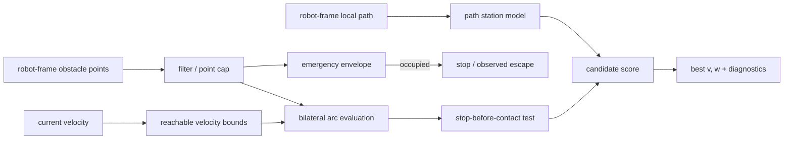

# アルゴリズムと保証範囲

[English](en/algorithm.md) | 日本語

## 対象

BACは、矩形footprintを持つ差動二輪ロボットについて、robot frameの障害物点、robot frameへ変換した
局所path、現在の並進・角速度から、次の定曲率指令`(v,w)`を選ぶ。障害物は1制御周期内では静的点群、
ロボットはユニサイクル運動学に従うものとして扱う。




## 処理

1. 入力点を距離と自己反射除外boxでfilterし、`max_points`を超える場合は入力順を保って間引く。
2. 現在速度の制動距離を含むfootprint周囲のemergency envelopeを調べる。移動中に点が入れば停止を
   優先し、停止済みならoffending pointから離れる低速escape候補だけを許す。後退escapeを有効にする
   場合は、後方観測を前提にできなければならない。
3. 現在の進行方向で衝突コースにある点から並進速度上限を計算する。平行壁のように現在円弧が余裕を
   持って外す点は、この減速判定から除外する。
4. 並進dynamic window内の`v`と`[-w_max,w_max]`の`w`を組み合わせ、停止、回頭、後退候補も生成する。
5. 各候補について、定曲率運動中の矩形footprintと障害点の初接触弧長を閉形式で求める。接触前に
   設定した`stop_decel`で停止できない候補は棄却する。
6. 候補終端をpathへ射影し、進行度、経路接線との方位差、弱い横偏差を計算する。障害物で塞がれた
   path区間では横偏差の引力を無効化する。
7. 左右クリアランス、狭所での左右差、path項、前回操舵との差、側方圧迫を合成し、最良候補を返す。
   粗探索後は最良角速度の近傍を細分する。

既定値での概略scoreは次のとおりである。`tightness`は両側が狭い場合だけ1へ近づく。

```text
score = 2.0 * min(clearance, adaptive_cap)
      - 4.0 * tightness * abs(clearance_left - clearance_right)
      - 1.0 * (remaining_path_arclength + 0.3 * path_offset)
      - 0.15 * abs(heading_error_vs_path_tangent)
      - 0.6 * abs(w - previous_w)
      - 0.5 * abs(v) * lateral_squeeze
```

低速時も最低`min_eval_distance`まで評価する。ただし遠方まで円弧を外挿して反対側の壁を誤評価しない
よう、評価角`eval_angle_max`と横変位`eval_lateral_max`で窓を制限する。全パラメータと単位は
[パラメータリファレンス](parameters.md)を参照する。

## 主張を3段階に分ける

### 実装で固定している判定規則

- 観測点がemergency envelope内にある間、通常の前進候補を出さない。
- 観測した静的点との予測接触前に停止できない定曲率候補を採用しない。
- 衝突コース上の点に対する並進速度上限は、同じ判定条件内では近づくほど厳しくなる。
- 狭所では左右クリアランス差をscoreへ明示的に入れる。

これらは入力点、footprint、制動modelが正しいという条件下の**アルゴリズム上の規則**である。
センサ未観測領域や実機追従誤差を含む衝突回避保証ではない。

### シミュレーションで観測した性質

- 正準18シナリオ × 3 runでBACは54/54成功、衝突0、最接近0.139 mだった。
- 1.5 m通路のpath横ずれ0.10〜0.25 mでは、到達時間28.8 s、クリアランス0.22〜0.23 mだった。
- 幅1.35、1.25、1.15 mの狭窄では段階的に減速し、1.15 mでは前進を拒否した。

これは[評価条件](method_comparison.md#同一条件-nav2-ベンチマーク)内の観測であり、未試験環境へ
確率的・普遍的に一般化しない。

### 保証しないこと

- センサ死角、遅延、外れ値、誤った外部パラメータ下での安全
- 動的障害物の将来位置予測
- 地図、TF、plan、odomを含む任意の上流障害からの独立
- 角加速度過渡中のswept trajectoryとjerk
- 滑り、下位速度制御遅れ、制御周期超過を含むstop-before-contact
- holonomic / Ackermann motion model

実機の最終防護には、センサcoverageとtimeoutを独立に設定したCollision Monitor等を併用する。
