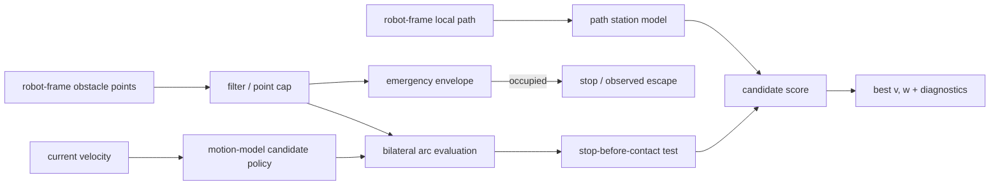

# Algorithm and claim boundaries

English | [日本語](../algorithm.md)

## Scope

For a differential-drive, Ackermann, or holonomic robot with a rectangular footprint, BAC selects the next
constant-curvature command `(v,w)` from robot-frame obstacle points, a local path transformed into the robot
frame, and the current linear and angular velocity. Obstacles are modeled as static points during one control
cycle. Both models move the body along a constant-curvature arc. Differential drive bounds only its translating
candidates, by the scoring-side `turn_radius_min`, and may rotate in place. Ackermann bounds body curvature
itself as a kinematic constraint and has no in-place rotation. As in Nav2 MPPI, the vehicle model is described
only to this body-level constraint; road-wheel kinematics belong to the downstream controller.




## Processing steps

1. Filter input points by range and the self-reflection exclusion box. If the count exceeds `max_points`,
   subsample while preserving input order.
2. Check the emergency envelope around the footprint, including braking distance at the current speed. If a point
   enters while the robot is moving, prioritize stopping. At standstill, allow only a low-speed escape candidate
   that moves away from the offending point. Reverse escape requires adequate rear sensing.
3. Compute a linear-speed cap from points on a collision course in the current travel direction. Exclude points,
   such as a parallel wall, that the current arc clears with sufficient margin from this governor test.
4. Generate candidates using the selected motion model. Differential drive combines the linear dynamic window
   with yaw rates and may add in-place rotation. Ackermann samples the admissible curvature range
   `|kappa| <= min(1 / turn_radius_min, w_max / |v|)` at each speed, reverse included, and converts it through
   `w = v * kappa`; in-place rotation never appears in its lattice. Both may add a near-standstill reverse
   escape when reverse is enabled.
5. For each candidate, compute in closed form the first contact arc length between the moving rectangular
   footprint and obstacle points. Reject a candidate that cannot stop before contact using `stop_decel`.
6. Project the candidate endpoint onto the path and compute path progress, heading difference from the path
   tangent, and a weak lateral-offset term. Disable lateral attraction on path segments blocked by obstacles.
7. Combine bilateral clearance, the left–right difference in tight spaces, path terms, steering hysteresis, and
   lateral squeeze. Refine yaw rate for differential drive or curvature for Ackermann around the best coarse
   candidate, enforce one-cycle reachability, and recheck the clamped arc. Any contact-driven speed reduction
   scales both `v` and `w` to preserve curvature; reachability and contact are rechecked if necessary.

With default weights, the approximate score is:

```text
score = 2.0 * min(clearance, adaptive_cap)
      - 4.0 * tightness * abs(clearance_left - clearance_right)
      - 1.0 * (remaining_path_arclength + 0.3 * path_offset)
      - 0.15 * abs(heading_error_vs_path_tangent)
      - 0.6 * steering_change
      - 0.5 * abs(v) * lateral_squeeze
```

Evaluation extends to at least `min_eval_distance` even at low speed. To avoid extrapolating a curved candidate
far enough to misclassify the opposite wall, the window is bounded by `eval_angle_max` and
`eval_lateral_max`. `steering_change` is yaw-rate change for differential drive and body-curvature change for
Ackermann. See the [parameter reference](parameters.md) for all parameters and units.

## Three levels of claims

### Rules enforced by the implementation

- Normal forward candidates are not emitted while an observed point is inside the emergency envelope.
- A constant-curvature candidate that cannot stop before predicted contact with an observed static point is not
  selected.
- Within the same decision conditions, the linear-speed cap for a point on a collision course becomes more
  restrictive as that point gets closer.
- The score explicitly includes the difference between left and right clearance in a tight passage.

These are **algorithmic rules** conditional on correct input points, footprint, and braking model. They are not a
collision-avoidance guarantee covering unobserved space or physical tracking error.

### Properties observed in simulation

The published benchmark observations below use the differential-drive model.

- BAC succeeded in 54/54 episodes in the canonical 18 scenarios × 3 runs, with zero collisions and a worst
  minimum clearance of 0.136 m.
- In a 1.5 m corridor with 0.10–0.25 m lateral path offset, it succeeded in 8/8 episodes, with a mean traversal
  time of 28.8 s and clearance of 0.225–0.230 m.
- In a one-run opening-width sweep, it completed openings down to 1.25 m but timed out at 1.15 m after reaching
  0.050 m minimum clearance. The other three controllers completed that 1.15 m trial, so BAC showed no advantage
  at this boundary condition.
- The holonomic policy avoids with lateral velocity and uses yaw to regulate pose. Its candidate lattice is
  forward speed × lateral speed - two dimensions, like the differential-drive forward speed × yaw rate lattice,
  though not the same candidate count. Measured with the shipped holonomic values (`limits.v_max` 0.4,
  `limits.vy_max` 0.3, `limits.w_max` 1.0, `v_samples` 5, `vy_samples` 15, `w_samples` 25) from a current
  velocity of (0.20 m/s, 0.0 rad/s): 96 against 130. The conditions matter. Sweeping the current forward speed
  over 41 points from 0.00 to 0.40 m/s (0.01 steps, zero yaw, open field, path straight ahead), **the shipped
  `limits.v_min: 0.0` gives 130 differential-drive candidates at 21 of the points and 156 at the other 20;
  182 never occurs.** 182 requires reverse to be enabled: at `limits.v_min` = -0.05 the sweep gives 130 once,
  156 at 20 points and 182 at 20; at -0.10 and -0.15 it gives 130 once, 156 at 31 points and 182 at 9. The
  holonomic count is 96 at all 41 points. These count the COARSE lattice only (measured with
  `w_refine_steps` set to 0). With the shipped 3, refinement adds 2 x 3 candidates and every number above is 6
  larger (136 at 21 points and 162 at 20 for differential drive, 102 at all 41 for the holonomic model).
  Refinement runs when the coarse winner is not the stop row, so the +6 holds wherever the winner is a moving
  row; measured over all 41 points, at a current speed of 0.00 included, both in an empty field and with a wall
  1.2 m ahead. R19 H3: this paragraph previously said the same settings give 156 or 182 from other current speeds,
  which the shipped `limits.v_min` cannot produce - it contradicted the conditions the preceding sentence
  declares. The yaw rate is fixed before candidate generation so the trajectory that is scored is the trajectory
  that is driven. In a passage the regulator adds the bilateral clearance imbalance and points the body INTO the gap
  rather than crabbing towards it, because a crabbing rectangle sweeps wider than a straight one (0.86 m at 55
  degrees for a 0.7 × 0.5 m body against 0.5 m going straight); the term is gated to passages — bounded on both
  sides and open straight ahead. The cap is `footprint.width / 2 + avoid_margin.side`: for the shipped
  holonomic body, 0.5 m wide, an `avoid_margin.side` of 0.5 puts that cap at 0.75 m, so an ordinary 1.6 m
  corridor reads as "open" on the far side and the term never fires at all.
  **The measurement conditions are stated here** because R15 M12 found that a table
  without them did not reproduce on a reviewer's bench: entry offset 0.30 m, `avoid_margin.side` 0.9 for BOTH
  models, a 7.5 m corridor (x = 2.0 to 9.5 m), `heading_gain` 1.5. Under those conditions the mean lateral error for corridor widths
  1.1 / 1.2 / 1.3 / 1.6 / 1.8 m, with 0.10 m thick walls, is 0.0131 / 0.0148 / 0.0171 / 0.0159 / 0.0160 m against
  0.0259 / 0.0280 / 0.0288 / 0.0260 / 0.0255 m for differential drive, a factor of 1.6 to 2.0. Lowering `avoid_margin.side` stops the
  bilateral term from engaging at all: in a 1.6 m corridor with 0.10 m thick walls the mean error is 0.0159 m at
  0.9 and 0.1412 m at 0.5. The transition is not monotone. Swept over 0.500-0.900 in 0.005 steps (81 points):
  0.690 = 0.2009, 0.695 = 0.1900, 0.700 = 0.0330, 0.705 = 0.1869, 0.710 = 0.0152, 0.715 = 0.0156,
  0.720 = 0.0150, **0.725 = 0.1600**, 0.730 = 0.0156, and 0.735 upwards 0.0131-0.0162.
  **Do not read those 81 points as "0.730 and up is safe."** They all reproduce, but the 0.005 grid ALIASES:
  re-swept at 0.001 (and at 0.0002 above 0.730) the bad cells are BANDS, not points, and the grid lands
  inside or outside them almost at random. Measured: 0.702-0.708 is
  0.1863-0.1952 (the 0.005 grid touches only 0.705); 0.721-0.729 is 0.1444-0.1600, with 0.723 = 0.0146 the one
  good cell inside it (the 0.005 grid touches only 0.725); and **0.7370-0.7386 is 0.0846-0.1074**, peaking at
  0.1074 at 0.7380 and 0.7382 with two good cells inside it as well (0.7376 and 0.7378 are 0.0160) - a band
  that the 0.005 grid AND the 0.001 grid both largely step over
  (0.735 = 0.0131, 0.736 = 0.0169, 0.739 = 0.0160). The correct statement is therefore that **0.70-0.74 is a
  non-monotone region which the 0.005 grid aliases, and no value in it may be chosen by interpolating between
  measured points** - adjacent thousandths differ by an order of magnitude. Above it the rig is flat: all 807 points
  from 0.7388 to 0.900 in 0.0002 steps lie between **0.015658 (at 0.8004) and 0.016315 (at 0.8726)** - every
  one of them below 0.017, and none of them anywhere near the 0.08-0.20 the bands above reach - so no band of
  this kind was FOUND above 0.739; that is a measurement at 0.0002 resolution and does not rule out a narrower
  one. (R19, fourth pass: the interval given here was 0.0157-0.0163, which 28 of the 807 points fall outside;
  it had been carried over from a coarser subsample. Re-measured over all 807.) The shipped 0.9
  sits well clear of the region, and 0.8 (0.016102) reaches essentially the same value as 0.9 (0.015945),
  so the shipped 0.9 is a margin over that boundary rather than a required value. R19 H4:
  this paragraph previously said 0.705 and 0.710 are back above 0.18 and that it is stable from 0.715 - the
  0.1900 and 0.1869 belong to 0.695 and 0.705, one and two cells off, and 0.725 is a counterexample that was
  missing. The first pass of the R19 response replaced that with "stable below 0.017 from 0.730 up", which is
  true only as a statement about the 0.005 grid: 0.737 and 0.738 are counterexamples to it. R18 M6: the pair
  quoted here before (0.0119 / 0.139) came from the older zero-thickness fixture
  rather than from the rig this paragraph declares.
  **The entry offset has a limit.** Swept from 0.30 to 0.50 m in 0.002 m steps - 101 cells, counting a contact,
  a failure to traverse, or a route around the outside as a failure - a 1.2 m corridor with 0.10 m thick walls
  passes **all 101**, while a 1.1 m one starts failing at 0.418 m. Modelling the walls as zero-thickness lines
  makes both worse: 1.2 m starts failing at 0.476 m and 1.1 m at 0.372 m. Rounding an isolated obstacle it
  commands a peak |yaw rate| of 0.0437 rad/s where differential drive needs 0.3125. It passes twenty-seven
  deterministic tests, ten unit and seventeen closed-loop.
- The Ackermann policy passes thirteen deterministic tests — forward lateral goal, offset corridor, obstacle
  detour, dead-end stop, rear goal, turning-radius binding, yaw-rate-limit binding, clearance-probe reach, the
  shipped example configuration, safety stop (forward-only), safety stop (reverse escape), narrow-corridor
  centering, and a clutter field — against a plant whose speed is acceleration-limited and whose curvature slews
  at a bounded rate. The rear-goal test contrasts it with a differential-drive reference that shares the same
  tuning apart from `turn_radius_min` and does turn on the spot. The centering test bounds lateral error,
  curvature sign changes and stop ticks; the clutter test bounds clearance and stop ticks; per-cycle curvature
  change is bounded in the offset-corridor and shipped-configuration runs, where a threshold was measured to
  separate correct from broken behaviour. These are regression tests, not vehicle evidence.

These observations apply only to the [evaluation conditions](method_comparison.md#nav2-system-benchmark).
They are not probabilistic or universal claims about untested environments.

### Not guaranteed

- Safety under sensor blind spots, latency, outliers, or incorrect extrinsics
- Prediction of future dynamic-obstacle positions
- Independence from arbitrary failures in the map, TF, plan, odometry, or other upstream components
- The swept trajectory and jerk during angular-acceleration or steering transients
- Stop-before-contact behavior including slip, downstream control delay, or control-period overruns
- The downstream mapping from body twist to road-wheel steering, and its steering rate and tracking error
- A commanded goal ORIENTATION under `diff_drive` or `ackermann`: a model that steers with yaw cannot choose its
  orientation independently of its direction of travel, so the final heading is whatever the path tangent leaves
  behind. The holonomic model does honour it
- **Avoiding a THIN wall entered almost parallel to it.** BAC sees only the points it is given. Rays cast nearly
  tangentially at a surface with no thickness can pass between beams, so the very edge the body is about to touch
  may never appear as a point, and what cannot be measured cannot be avoided. At 0.5 degrees of angular
  resolution (720 beams over 360 degrees) this produced a contact at `616746b`, and **it is not resolved at the
  current revision**: sweeping a 1.2 m zero-thickness corridor from 0.30 to 0.50 m in 0.002 m steps still
  contacts in **3 of the 101 cells, at 0.478, 0.488 and 0.498 m** (R18 H5 - this paragraph previously claimed the
  controller no longer drove into that position, which is false; R19 M3 - the count of 2 was also low, counted
  again with the `collided` flag the closed-loop runs already carry). The same corridor with 0.10 m walls
  traverses all 101 cells without contact. Real walls present a face, so that configuration is a modelling
  degeneracy rather than a scenario: the regressions use walls with thickness. Raising the resolution (2880
  beams or more) or giving the wall thickness both remove it. The sensing limit is a property of the sensor,
  not of the controller. The 0.478 m cell is sensitive to floating-point representation:
  building the sweep the obvious way as `start + step * i` gives `0.30f + 0.002f * 89` = 0.478000015, which
  contacts (closest approach 0.2874 m), while the literal `0.478f` is 0.477999985 and does not (0.5448 m). The
  difference is 3e-8, and any sweep built that way contacts. Across the four conditions swept (1.1 and 1.2 m
  widths, 0.10 m and zero thickness, 404 cells) there are **91 failures, of which 3 are contacts**, all in the
  zero-thickness 1.2 m corridor. **Splitting the rest into detours and non-traversals depends on a criterion**
  that was never written down (R19 L9), so the criterion is stated here: a contact is a scan point inside the
  body rectangle (the closed loop's `collided`), a detour is a lateral excursion past corridor width / 2 plus
  wall thickness, a non-traversal is neither of those with a final x short of 9.0 m, and the three are applied
  in that order, **with the lateral excursion taken over the whole run**. **Inside the measurement window the
  detour / non-traversal split is the same under either threshold; drop the window and the threshold changes
  it.** Taking the excursion only INSIDE the corridor (the x = 3.0 to 9.0 m measurement window) turns the
  same data into **72 detours and 16 non-traversals**, and inside that window the two thresholds measured
  give the same split: corridor width / 2 plus wall thickness (0.70 / 0.65 / 0.60 / 0.55 m across the four
  conditions) and the `kInsideCorridor` = 0.35
  that this package's own `testNarrowCorridorCentering` uses give **the same 72 and 16 in all four
  conditions** (measured). Drop the window and the threshold does matter: corridor width / 2 plus wall
  thickness gives the 83 detours and 5 non-traversals totalled below, and 0.35 taken over the whole run gives
  324 detours and 0 non-traversals. Those are the four cells measured. The 72 / 16 the first pass of the R19 M3
  response wrote here reproduces exactly under that windowed criterion, the one
  `testNarrowCorridorCentering` uses - so that split was not wrong, it simply never stated its criterion
  (established by the R19 verification).
  Measured over the whole run: 1.2 m / 0.10 m fails 0; 1.1 m / 0.10 m fails 35 (34 detours, 1
  non-traversal, first at 0.418); 1.2 m / zero fails 10 (3 contacts, 3 detours, 4 non-traversals, first at
  0.476); 1.1 m / zero fails 46 (46 detours, first at 0.372) - 3 contacts, 83 detours and 5 non-traversals in
  total. Of the four criteria measured, the 91 total, the per-condition failure counts (0 / 35 / 10 / 46) and
  the first failing offsets (- / 0.418 / 0.476 / 0.372) agree under three: the whole run with corridor
  width / 2 plus wall thickness, the window with that same threshold, and the window with 0.35. **They do
  not agree under the whole run with 0.35** - that gives 327 failures, 85 / 82 / 80 / 80 per condition, and
  first failing offsets 0.332 / 0.338 / 0.340 / 0.342 (the 324 detours and 0 non-traversals stated above).
  The 3 contacts are the same under all four criteria measured.
- Physical-vehicle evidence for the holonomic model; its validation is deterministic unit checks and closed-loop
  regressions only
- Reaching a rear goal with a forward-only Ackermann configuration (`limits.v_min = 0`). BAC stops and leaves the
  multi-point turn to a Nav2 recovery

For final protection on a physical robot, use an independent layer such as Collision Monitor with separately
configured sensor coverage and timeouts.
