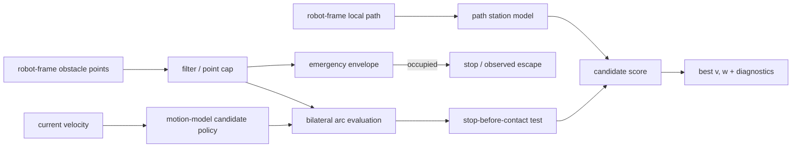

# Algorithm and claim boundaries

English | [日本語](../algorithm.md)

## Scope

For a differential-drive or Ackermann robot with a rectangular footprint, BAC selects the next
constant-curvature command `(v,w)` from robot-frame obstacle points, a local path transformed into the robot
frame, and the current linear and angular velocity. Obstacles are modeled as static points during one control
cycle. Both models move the body along a constant-curvature arc. Differential drive bounds only its translating
candidates, by the scoring-side `turn_radius_min`, and may rotate in place. Ackermann bounds body curvature
itself as a kinematic constraint and has no in-place rotation. As in Nav2 MPPI, the vehicle model is described
only to this body-level constraint; road-wheel kinematics belong to the downstream controller.




## Processing steps

1. Filter input points by range and the self-reflection exclusion box. If the count exceeds `max_points`,
   subsample while preserving input order.
2. Check the emergency envelope around the footprint, including braking distance at the current speed. If a point
   enters while the robot is moving, prioritize stopping. At standstill, allow only a low-speed escape candidate
   that moves away from the offending point. Reverse escape requires adequate rear sensing.
3. Compute a linear-speed cap from points on a collision course in the current travel direction. Exclude points,
   such as a parallel wall, that the current arc clears with sufficient margin from this governor test.
4. Generate candidates using the selected motion model. Differential drive combines the linear dynamic window
   with yaw rates and may add in-place rotation. Ackermann samples the admissible curvature range
   `|kappa| <= min(1 / turn_radius_min, w_max / |v|)` at each speed, reverse included, and converts it through
   `w = v * kappa`; in-place rotation never appears in its lattice. Both may add a near-standstill reverse
   escape when reverse is enabled.
5. For each candidate, compute in closed form the first contact arc length between the moving rectangular
   footprint and obstacle points. Reject a candidate that cannot stop before contact using `stop_decel`.
6. Project the candidate endpoint onto the path and compute path progress, heading difference from the path
   tangent, and a weak lateral-offset term. Disable lateral attraction on path segments blocked by obstacles.
7. Combine bilateral clearance, the left–right difference in tight spaces, path terms, steering hysteresis, and
   lateral squeeze. Refine yaw rate for differential drive or curvature for Ackermann around the best coarse
   candidate, enforce one-cycle reachability, and recheck the clamped arc. Any contact-driven speed reduction
   scales both `v` and `w` to preserve curvature; reachability and contact are rechecked if necessary.

With default weights, the approximate score is:

```text
score = 2.0 * min(clearance, adaptive_cap)
      - 4.0 * tightness * abs(clearance_left - clearance_right)
      - 1.0 * (remaining_path_arclength + 0.3 * path_offset)
      - 0.15 * abs(heading_error_vs_path_tangent)
      - 0.6 * steering_change
      - 0.5 * abs(v) * lateral_squeeze
```

Evaluation extends to at least `min_eval_distance` even at low speed. To avoid extrapolating a curved candidate
far enough to misclassify the opposite wall, the window is bounded by `eval_angle_max` and
`eval_lateral_max`. `steering_change` is yaw-rate change for differential drive and body-curvature change for
Ackermann. See the [parameter reference](parameters.md) for all parameters and units.

## Three levels of claims

### Rules enforced by the implementation

- Normal forward candidates are not emitted while an observed point is inside the emergency envelope.
- A constant-curvature candidate that cannot stop before predicted contact with an observed static point is not
  selected.
- Within the same decision conditions, the linear-speed cap for a point on a collision course becomes more
  restrictive as that point gets closer.
- The score explicitly includes the difference between left and right clearance in a tight passage.

These are **algorithmic rules** conditional on correct input points, footprint, and braking model. They are not a
collision-avoidance guarantee covering unobserved space or physical tracking error.

### Properties observed in simulation

The published benchmark observations below use the differential-drive model.

- BAC succeeded in 54/54 episodes in the canonical 18 scenarios × 3 runs, with zero collisions and a worst
  minimum clearance of 0.136 m.
- In a 1.5 m corridor with 0.10–0.25 m lateral path offset, it succeeded in 8/8 episodes, with a mean traversal
  time of 28.8 s and clearance of 0.225–0.230 m.
- In a one-run opening-width sweep, it completed openings down to 1.25 m but timed out at 1.15 m after reaching
  0.050 m minimum clearance. The other three controllers completed that 1.15 m trial, so BAC showed no advantage
  at this boundary condition.
- The holonomic policy avoids with lateral velocity and uses yaw to regulate pose. Its candidate lattice is
  forward speed × lateral speed, the same size as the differential-drive forward speed × yaw rate lattice, and
  the yaw rate is fixed before candidate generation so the trajectory that is scored is the trajectory that is
  driven. In a passage the regulator adds the bilateral clearance imbalance and points the body INTO the gap
  rather than crabbing towards it, because a crabbing rectangle sweeps wider than a straight one (0.86 m at 55
  degrees for a 0.7 × 0.5 m body against 0.5 m going straight); the term is gated to passages — bounded on both
  sides and open straight ahead. Measured mean lateral error at an entry offset of 0.30 m, for corridor widths
  1.1 / 1.2 / 1.3 / 1.6 / 1.8 m, is 0.013 / 0.014 / 0.012 / 0.012 / 0.016 m against 0.025 / 0.026 / 0.027 /
  0.037 / 0.035 m for differential drive in the same corridors; at 1.0 m it stops at the mouth. Rounding an
  isolated obstacle it commands a peak |yaw rate| of 0.036 rad/s where differential drive needs 0.313. It passes
  seventeen deterministic tests, nine unit and eight closed-loop.
- The Ackermann policy passes thirteen deterministic tests — forward lateral goal, offset corridor, obstacle
  detour, dead-end stop, rear goal, turning-radius binding, yaw-rate-limit binding, clearance-probe reach, the
  shipped example configuration, safety stop (forward-only), safety stop (reverse escape), narrow-corridor
  centering, and a clutter field — against a plant whose speed is acceleration-limited and whose curvature slews
  at a bounded rate. The rear-goal test contrasts it with a differential-drive reference that shares the same
  tuning apart from `turn_radius_min` and does turn on the spot. The centering test bounds lateral error,
  curvature sign changes and stop ticks; the clutter test bounds clearance and stop ticks; per-cycle curvature
  change is bounded in the offset-corridor and shipped-configuration runs, where a threshold was measured to
  separate correct from broken behaviour. These are regression tests, not vehicle evidence.

These observations apply only to the [evaluation conditions](method_comparison.md#nav2-system-benchmark).
They are not probabilistic or universal claims about untested environments.

### Not guaranteed

- Safety under sensor blind spots, latency, outliers, or incorrect extrinsics
- Prediction of future dynamic-obstacle positions
- Independence from arbitrary failures in the map, TF, plan, odometry, or other upstream components
- The swept trajectory and jerk during angular-acceleration or steering transients
- Stop-before-contact behavior including slip, downstream control delay, or control-period overruns
- The downstream mapping from body twist to road-wheel steering, and its steering rate and tracking error
- A commanded goal ORIENTATION under `diff_drive` or `ackermann`: a model that steers with yaw cannot choose its
  orientation independently of its direction of travel, so the final heading is whatever the path tangent leaves
  behind. The holonomic model does honour it
- Physical-vehicle evidence for the holonomic model; its validation is deterministic unit checks and closed-loop
  regressions only
- Reaching a rear goal with a forward-only Ackermann configuration (`limits.v_min = 0`). BAC stops and leaves the
  multi-point turn to a Nav2 recovery

For final protection on a physical robot, use an independent layer such as Collision Monitor with separately
configured sensor coverage and timeouts.
