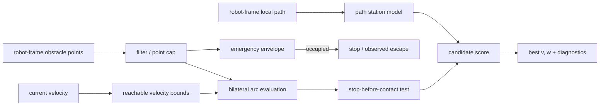

# Algorithm and claim boundaries

English | [日本語](../algorithm.md)

## Scope

For a differential-drive robot with a rectangular footprint, BAC selects the next constant-curvature command
`(v,w)` from robot-frame obstacle points, a local path transformed into the robot frame, and the current linear
and angular velocity. Obstacles are modeled as static points during one control cycle, and the robot is modeled
with unicycle kinematics.




## Processing steps

1. Filter input points by range and the self-reflection exclusion box. If the count exceeds `max_points`,
   subsample while preserving input order.
2. Check the emergency envelope around the footprint, including braking distance at the current speed. If a point
   enters while the robot is moving, prioritize stopping. At standstill, allow only a low-speed escape candidate
   that moves away from the offending point. Reverse escape requires adequate rear sensing.
3. Compute a linear-speed cap from points on a collision course in the current travel direction. Exclude points,
   such as a parallel wall, that the current arc clears with sufficient margin from this governor test.
4. Combine `v` values in the linear dynamic window with `w` values in `[-w_max,w_max]`, including stop, rotate,
   and reverse candidates.
5. For each candidate, compute in closed form the first contact arc length between the moving rectangular
   footprint and obstacle points. Reject a candidate that cannot stop before contact using `stop_decel`.
6. Project the candidate endpoint onto the path and compute path progress, heading difference from the path
   tangent, and a weak lateral-offset term. Disable lateral attraction on path segments blocked by obstacles.
7. Combine bilateral clearance, the left–right difference in tight spaces, path terms, steering hysteresis, and
   lateral squeeze. Refine the angular velocity around the best coarse candidate and return the best command.

With default weights, the approximate score is:

```text
score = 2.0 * min(clearance, adaptive_cap)
      - 4.0 * tightness * abs(clearance_left - clearance_right)
      - 1.0 * (remaining_path_arclength + 0.3 * path_offset)
      - 0.15 * abs(heading_error_vs_path_tangent)
      - 0.6 * abs(w - previous_w)
      - 0.5 * abs(v) * lateral_squeeze
```

Evaluation extends to at least `min_eval_distance` even at low speed. To avoid extrapolating a curved candidate
far enough to misclassify the opposite wall, the window is bounded by `eval_angle_max` and
`eval_lateral_max`. See the [parameter reference](parameters.md) for all parameters and units.

## Three levels of claims

### Rules enforced by the implementation

- Normal forward candidates are not emitted while an observed point is inside the emergency envelope.
- A constant-curvature candidate that cannot stop before predicted contact with an observed static point is not
  selected.
- Within the same decision conditions, the linear-speed cap for a point on a collision course becomes more
  restrictive as that point gets closer.
- The score explicitly includes the difference between left and right clearance in a tight passage.

These are **algorithmic rules** conditional on correct input points, footprint, and braking model. They are not a
collision-avoidance guarantee covering unobserved space or physical tracking error.

### Properties observed in simulation

- BAC succeeded in 54/54 episodes in the canonical 18 scenarios × 3 runs, with zero collisions and a worst
  minimum clearance of 0.136 m.
- In a 1.5 m corridor with 0.10–0.25 m lateral path offset, it succeeded in 8/8 episodes, with a mean traversal
  time of 28.8 s and clearance of 0.225–0.230 m.
- In a one-run opening-width sweep, it completed openings down to 1.25 m but timed out at 1.15 m after reaching
  0.050 m minimum clearance. The other three controllers completed that 1.15 m trial, so BAC showed no advantage
  at this boundary condition.

These observations apply only to the [evaluation conditions](method_comparison.md#nav2-system-benchmark).
They are not probabilistic or universal claims about untested environments.

### Not guaranteed

- Safety under sensor blind spots, latency, outliers, or incorrect extrinsics
- Prediction of future dynamic-obstacle positions
- Independence from arbitrary failures in the map, TF, plan, odometry, or other upstream components
- The swept trajectory and jerk during angular-acceleration transients
- Stop-before-contact behavior including slip, downstream control delay, or control-period overruns
- Holonomic or Ackermann motion models

For final protection on a physical robot, use an independent layer such as Collision Monitor with separately
configured sensor coverage and timeouts.
